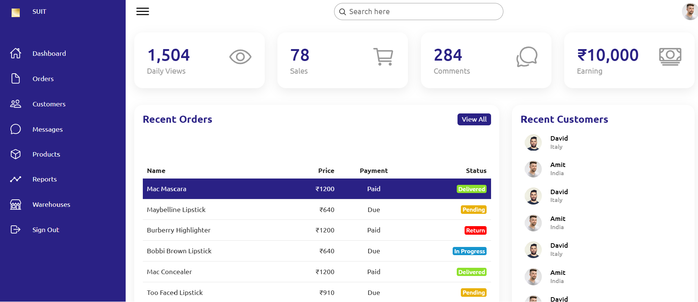

# SUIT - E-commerce Website with Integrated Admin Panel

## Project Overview
SUIT is a fully responsive e-commerce platform designed to provide a smooth shopping experience for customers and a powerful, user-friendly admin panel for managing products, categories, orders, and users. Built using HTML, CSS, and JavaScript, this project showcases a scalable and professional-grade e-commerce application.

## Features
### User Panel
- **Responsive Design**: Accessible on desktops, tablets, and mobile devices.
- **Product Browsing**: View products by category, search, and filter functionality.
- **Product Details**: View detailed product descriptions, images, and pricing.
- **Cart and Checkout**: Add items to the cart, view cart items, and proceed to checkout.

### Admin Panel
- **Product Management**: Create, update, and delete products.
- **Category Management**: Add and manage product categories.
- **Order Management**: View and update order statuses.
- **User Management**: Manage registered users and their order history.
- **Sales Reporting**: Track daily invoices and sales reporting.

## Screenshots
### Homepage


### Admin Dashboard


## Installation

To get a local copy of this project up and running, follow these steps:

1. **Clone the repository**:
   ```bash
   git clone https://github.com/yourusername/SUIT-Ecommerce-Website.git
